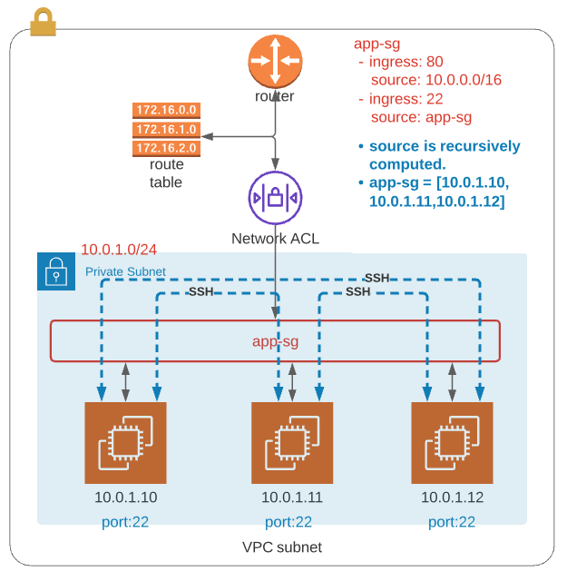

# Basics


## Route table, target and destination

Destination field specifies the pattern that a rquest must match with its destination address (IP or CIDR).
Target field specifies where such a request should be routed. 


| Destination | Target      |
|:------------|------------:|
| 10.0.0.0/16 | local       |
|  0.0.0.0/0  | your-igw-id |

This will route any request with into-the-VPC destination to local targets in the VPC.  If the patter ```10.0.0.0/16``` is not met, any IP ```0.0.0.0/0``` will be considered and the request will be routed to internet gateway id you specifed.  

The order of routes is irrelevant since the most specific route will be chosen. 

In short, the request must be sent to the relavent target first to reach to the final destination.

***request --->  target  ---> destination***


Private subnet vs. Public subnet

Private subnet has NAT Gateway as target in route table.

Private-subnet --> NAT Gateway (in Public-subnet) --> EIP (Elastic IP) --> Internet Gateway (in VPC) --> Destination


Public subnet has Internet Gateway as target in route table.

Public-subnet --> Internet Gateway (in VPC) --> Destination 


## AWS IAM Roles

When you create an IAM Role for EC2 using the AWS Management Console, it creates both an EC2 instance profile as well as an IAM role.

However, if you  are using AWS CLL, CloudFormation, or Terraform, you will need to explicitly define both:
* An IAM role with policies and permissions, and
* An EC2 instance profile specifying which roles it can assume


ref: https://medium.com/devops-dudes/the-difference-between-an-aws-role-and-an-instance-profile-ae81abd700d


The following is to enable SSM in EC2 instance. 
Creat IAM role and EC2 instance profile and attach policy and role.

```sh
#Instance Role
resource "aws_iam_role" "demo_role" {
  name = "ssm-ec2"
  assume_role_policy = <<EOF
{
  "Version": "2012-10-17",
  "Statement": [
    {
      "Action": "sts:AssumeRole",
      "Principal": {
        "Service": "ec2.amazonaws.com"
      },
      "Effect": "Allow",
      "Sid": ""
    }
  ]
}
EOF

  tags = {
    Name = "ssm-ec2"
  }
}

#Instance Profile
resource "aws_iam_instance_profile" "demo_profile" {
  name = "test-ssm-ec2"
  role = aws_iam_role.demo_role.id
}

#Attach Policies to Instance Role
resource "aws_iam_policy_attachment" "ssm_attach1" {
  name       = "ssm-attachment"
  roles      = [aws_iam_role.demo_role.id]
  policy_arn = "arn:aws:iam::aws:policy/AmazonSSMManagedInstanceCore"
}

resource "aws_iam_policy_attachment" "ssm_attach2" {
  name       = "ssm-attachment"
  roles      = [aws_iam_role.demo_role.id]
  policy_arn = "arn:aws:iam::aws:policy/service-role/AmazonEC2RoleforSSM"
}

#EC2 Instance
resource "aws_instance" "demo-ec2" {
    ami = "ami-ID"
    instance_type = "t2.micro"
    key_name = "test-key"
    subnet_id = module.vpc.vpc_public_subnet1
    vpc_security_group_ids = [module.vpc.vpc_security_group_id]
    monitoring = "true"
    iam_instance_profile = aws_iam_instance_profile.demo_profile.id
    # ssm agent is pre-installed in Amazon AMI
    # user_data = "${file("/Users/demo/install-ssm.sh")}"
    tags = {
        Name = "demo-ec2"
    }
}
```

## Security group vs NACL


| Security group | Network ACL |
|---------------------------|-----------------------|
|Firewall of EC2 instances  | Firewall of the VPC subnets|
|Tied to EC2 instances | Tied to subnets level |
|Stateful, incoming rule applies to outgoing rule automatically | Stateless, incoming rule will not be applied to outgoing rule |
|Support allow rules only | Support both allow and deny rules |
|Evaluate all the rules | The number order, top to bottom, the lower number gets processed first) |
|For ingress/inboud, security group is second layer of the defense | For ingress/inbod, NACL is the first layer of the defense |
|For egress/outbound, security group is first layer of the defense | For egress/outbound, NACL is the second layter of the defense |
|Instance can have multiple security group |Subnet can have only one NACL |   


## Attachig Security group

In AWS, Security Groups are applied to each resource individually.


You can create one Security Group then apply to all resources.  


So, let's say you had:

A security group (app-sg) permitting inbound HTTP access on port 80
Three EC2 instances in a private subnet associated with app-sg. 
Even though all three EC2 instances have the same security group, they are not able to SSH with each other. 
Make sure that the instances in the same security group does not mean those instances can communicate each other.  Security group is simply association to resources such that you still need to define ingress and egress rules for it.


So, if you wanted to permit all three instances to SSH to each other, you could add an inbound(ingress) rule to the security group:

Protocol: SSH (Port 22)
Source: app-sg
This says: "Allow any resource associated with this security group to receive traffic from any other resource associated with this security group on port 22".

Security group in ***Source*** is computed to IP addresses of EC2 instnaces associated with security group in run-time.  



The following one is a bit more complicated.
EC2(10.0.1.10) allows ingress port 80 from app2-sg(10.0.2.10, 10.0.2.11).

EC2(10.0.2.10) and EC2(10.0.2.11) allows ingress port 80 and 8080 within the same subnet (10.0.2.0/24).

EC2(10.0.2.10) and EC2(10.0.2.11) allows ingress port 8081 from app1-sg(10.0.1.10).

The IP addresses of instances are computed from Security Groups as you use security group as source.  


